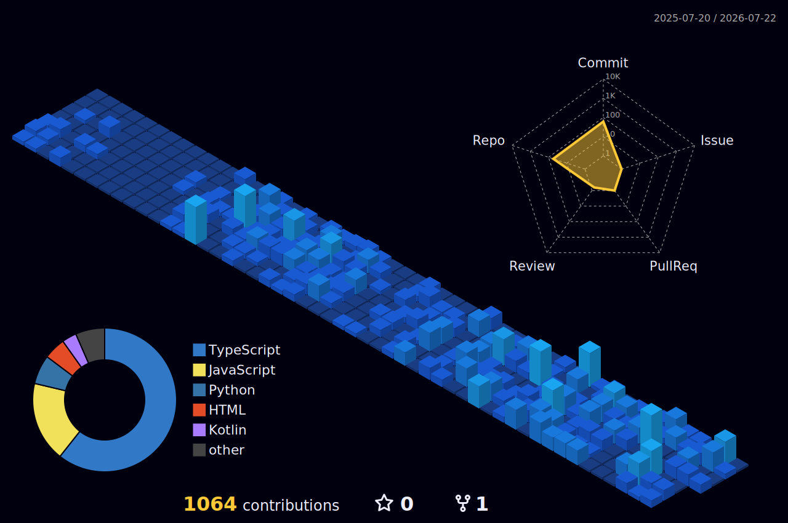

<h1 align="center">Hi 👋, I'm Martin Osei Boakye</h1>
<h3 align="center">A passionate Full-Stack Developer from Ghana 🇬🇭</h3>

  

---

### 👨‍💻 About Me

- 🎓 Currently studying **Computer Science** at KNUST, Kumasi.
- 🌱 I’m a junior full-stack developer who loves turning complex ideas into elegant, working products.
- ⚡ In my free time, I explore new technologies and build projects that solve real-world problems.
- 🤝 I'm open to collaborating on open-source projects, hackathons, and innovative startups.
- 📫 How to reach me: **[martinosb2023@gmail.com](mailto:martinosb2023@gmail.com)**

---

### 🛠️ Languages and Tools

  

---

### 📊 GitHub Stats

  
  

---

### 🐍 Contribution Snake

  <picture>
    <source media="(prefers-color-scheme: dark)" srcset="https://raw.githubusercontent.com/martinosb/martinosb/output/github-contribution-grid-snake-dark.svg">
    <source media="(prefers-color-scheme: light)" srcset="https://raw.githubusercontent.com/martinosb/martinosb/output/github-contribution-grid-snake.svg">
    
  </picture>

---

### 🏙️ 3D Contribution Calendar

  

---

  
  

  

